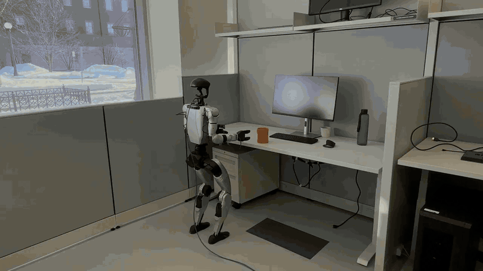
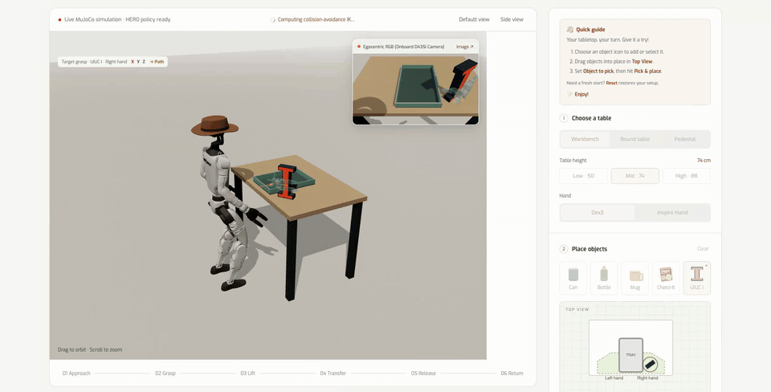

<div align="center">

# HERO

### Learning Humanoid End-Effector Control for<br>Visual Whole-Body Open-Vocabulary Object Grasping

[Runpei Dong](https://runpeidong.web.illinois.edu/) · [Ziyan Li](#) · [Arjun Gupta](https://arjung128.github.io/) · [Xialin He](https://xialin-he.github.io/) · [Saurabh Gupta](https://saurabhg.web.illinois.edu/)

<p>
  <a href="https://illinois.edu/">
    <picture>
      <source media="(prefers-color-scheme: dark)" srcset="assets/media/uiuc-logo-dark.svg">
      
    </picture>
  </a>
</p>

**CoRL 2026**

[](https://hero-humanoid.github.io/)
[](https://runpeidong.web.illinois.edu/runpei_files/hero.pdf)
[](https://arxiv.org/abs/2602.16705)
[](https://hero-humanoid.github.io/#interactive-demo)
[](https://huggingface.co/collections/RunpeiDong/hero)
[](#citation)

<a href="https://hero-humanoid.github.io/">
  
</a>

</div>

Train HERO in Isaac Sim and try humanoid grasping in your browser with the Unitree G1 and Dex3 hands.

Models and benchmark data: [Hugging Face collection](https://huggingface.co/collections/RunpeiDong/hero).

## Interactive demo

Select an object and click **Pick & place**. Physics and inference run locally in desktop Chrome or Edge. The bundled example ONNX model uses delta anchor to further improve end-effector tracking.

<p align="center">
  
</p>

<p align="center"><em>30-second loop · UIUC I → tray → return · Left-side Cheez-It (50 cm round table) → tray → return</em></p>

[Install and build the demo](#demo-and-data-tools), then open `build/demo/Tabletop_Lab.html`. See [checkpoint compatibility](checkpoints/README.md) for other policies.

## Installation

### Demo and data tools

Use Python 3.10+ and Node.js 18+. From the repository root:

```bash
python -m venv .venv
source .venv/bin/activate
python -m pip install --upgrade pip
python -m pip install -e '.[demo,dev]'
```

<details>
<summary><strong>Build the browser demo</strong></summary>

Export the example policy and scenes, then package the frontend:

```bash
python scripts/fetch_ycb_cracker_box.py

python -m sim2sim.interactive_client.export_policy_assets \
  --hero checkpoints/example/model.onnx --parity-fixture
python -m sim2sim.interactive_client.export_scene \
  --hero checkpoints/example/model.onnx

cd sim2sim/interactive_client
npm ci
python prepare_assets.py --delivery ../../build/demo
npm run build
python package_standalone.py --output ../../build/demo
```

For development, run `npm run dev` here and open <http://127.0.0.1:8768>.

</details>

### Training environment

Use Linux, an NVIDIA GPU, Isaac Sim 5.1, and Isaac Lab 2.3. [Install Isaac Lab](https://isaac-sim.github.io/IsaacLab/main/source/setup/installation/index.html), activate its environment, then install:

```bash
python -m pip install -e third_party/holosoma --no-deps
python -m pip install -e '.[train,dev]'
```

## Training data

The paper combines AMASS motions and generated IK reaches. Neither dataset is bundled.

### Prepare AMASS

Obtain [AMASS](https://amass.is.tue.mpg.de/) and retarget it to G1 before preparation:

```bash
python scripts/prepare_amass.py \
  --input /path/to/retargeted_amass_g1 \
  --output data/amass \
  --jobs 8
```

The input must contain G1 trajectories, not raw SMPL files. See [data formats and manifests](docs/data.md).

### Generate IK reaches

Start with the example generator:

```bash
python scripts/generate_ik_example.py \
  --output data/ik_examples --num-clips 32 --seed 0
```

Extend its targets, orientations, and motion profiles for your corpus. See `--help` and the [profile definitions](data_tools/reach_specs.py).

## Training

In the Isaac Lab environment, start with AMASS from the repository root:

```bash
python scripts/train.py --motion-dir data/amass
```

Use `--config` to select [training variants](configs/README.md): dual-actor PPO (default, with or without delta anchor), `without_delta_ee` (no residual end-effector feedback), or `*_single` (one whole-body actor). Outputs go to `runs/`.

For the paper's recipe, [combine AMASS and IK data with explicit source weights](docs/data.md#combine-amass-and-generated-reaching-data):

```bash
python scripts/train.py \
  --motion-dir /path/to/amass_and_generated_ik \
  --allow-mixed-data
```

## Export a trained policy

In the Isaac Lab environment, export ONNX with matching `_hero.json` metadata:

```bash
python scripts/export.py \
  --checkpoint /path/to/model_20000.pt \
  --motion-dir data/amass \
  --output checkpoints/my_policy
```

<details>
<summary><strong>Use your policy in the browser demo</strong></summary>

Export the policy and scenes from the same checkpoint:

```bash
python -m sim2sim.interactive_client.export_policy_assets \
  --hero checkpoints/my_policy/model_20000.onnx \
  --allow-custom-policy --parity-fixture
python -m sim2sim.interactive_client.export_scene \
  --hero checkpoints/my_policy/model_20000.onnx
```

Repeat the [frontend build steps](#demo-and-data-tools). Keep each model with its matching metadata.

</details>

## Validation

Use the training installation (bundled backend and `.[train,dev]`):

```bash
python -m pytest tests -q
cd sim2sim/interactive_client
npm test
node policy_parity.mjs ../../build/demo/policies
```

Parity compares browser inference with the native reference from `--parity-fixture`.

## Benchmark

`hero_bench_v1` has 1,298 reaching clips: core 420, extended 618, and stress 260. Core includes the paper's 180-target protocol byte for byte. MuJoCo evaluates open-loop control and HERO replanning, reporting world-frame palm errors, success rates, and confidence intervals.

```bash
pip install -e ".[bench]"
python scripts/hero_bench.py fetch --url https://huggingface.co/datasets/RunpeiDong/hero_bench/resolve/main/hero_bench_v1_corpus_33542601.tar.gz --sha256 33542601ed456ac606f8177ab75892d2e616585ec562f01976cb6af238c9c5d0 --out data/hero_bench_v1
python scripts/hero_bench.py run --corpus data/hero_bench_v1 --onnx-dir checkpoints/example --sidecar checkpoints/example/model_hero.json --out results/example --tiers core
python scripts/hero_bench.py report --corpus data/hero_bench_v1 --results results/example --card
```

See [benchmark protocols and corpus setup](docs/benchmark.md).

## Citation

Please cite HERO if you use it in your research:

```bibtex
@inproceedings{dong2026hero,
  title     = {{HERO}: Learning Humanoid End-Effector Control for Visual Whole-Body Open-Vocabulary Object Grasping},
  author    = {Dong, Runpei and Li, Ziyan and Gupta, Arjun and He, Xialin and Gupta, Saurabh},
  booktitle = {10th Annual Conference on Robot Learning},
  year      = {2026},
  url       = {https://openreview.net/forum?id=gbchkYm28k}
}
```

## Acknowledgments and license

Built with [HoloSoma](https://github.com/amazon-far/holosoma), [Isaac Lab](https://github.com/isaac-sim/IsaacLab), [MuJoCo](https://github.com/google-deepmind/mujoco), [Mink](https://github.com/kevinzakka/mink), [ONNX Runtime](https://github.com/microsoft/onnxruntime), and [Three.js](https://threejs.org/).

Code: [MIT](LICENSE). Third-party terms: [THIRD_PARTY_NOTICES.md](THIRD_PARTY_NOTICES.md).
